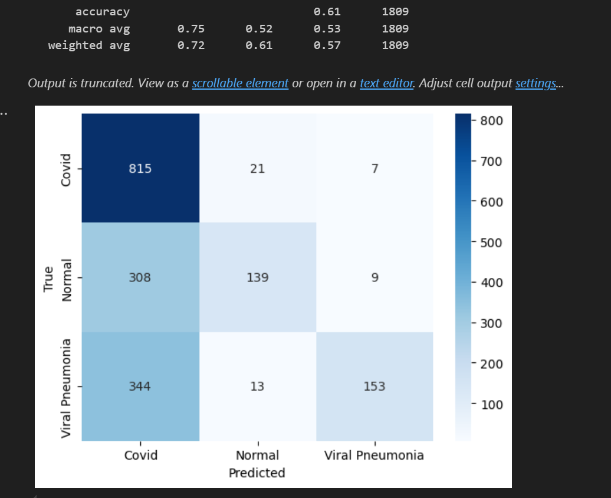
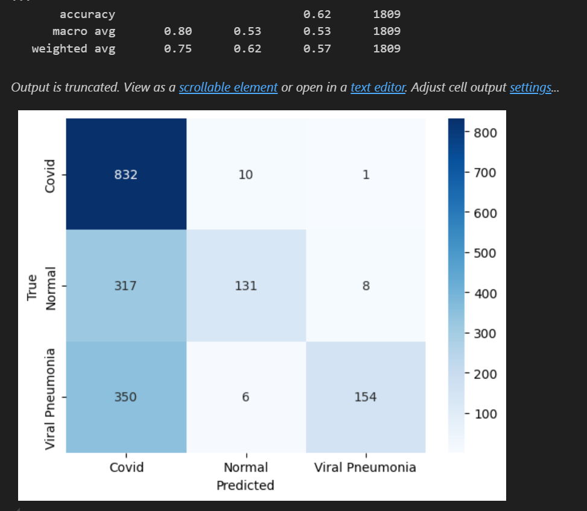
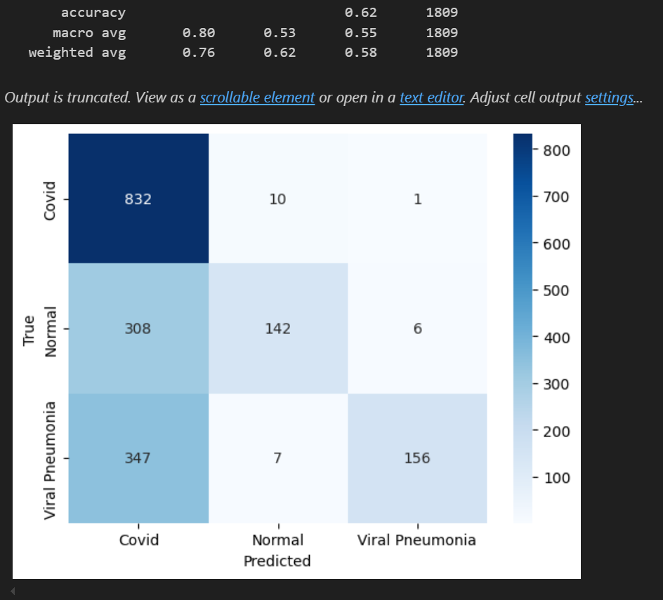
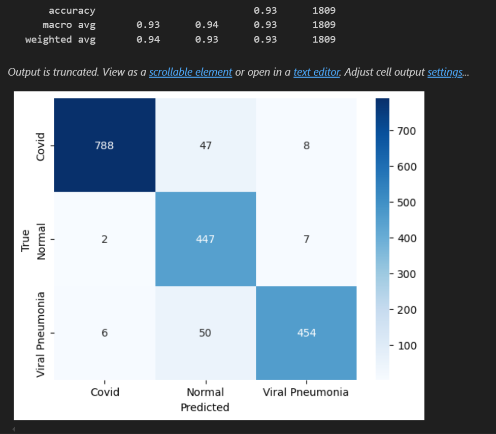
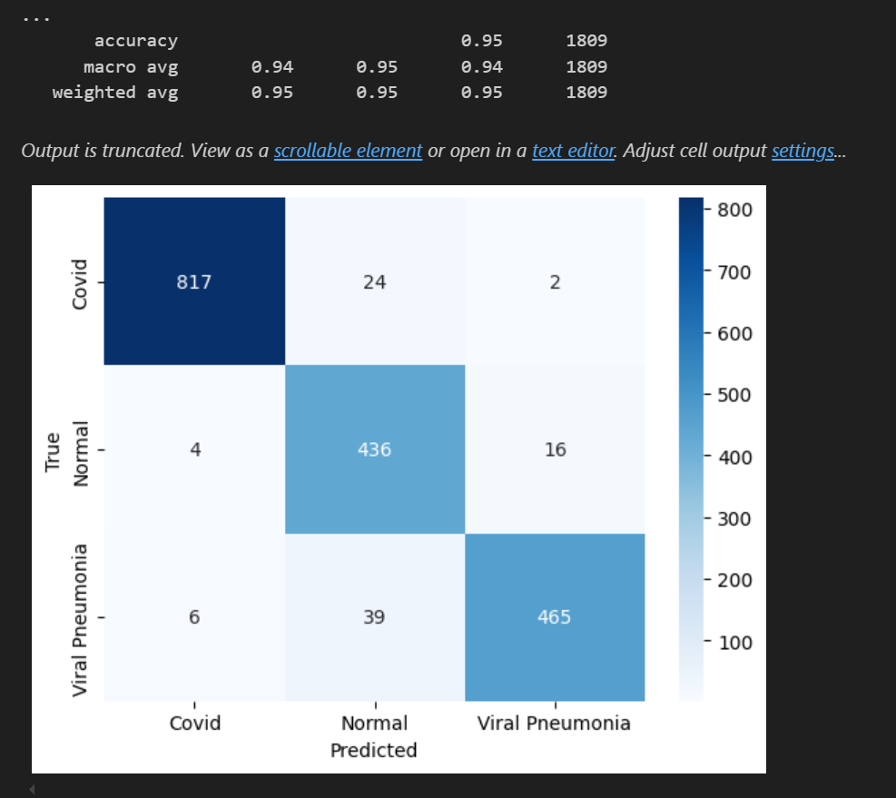
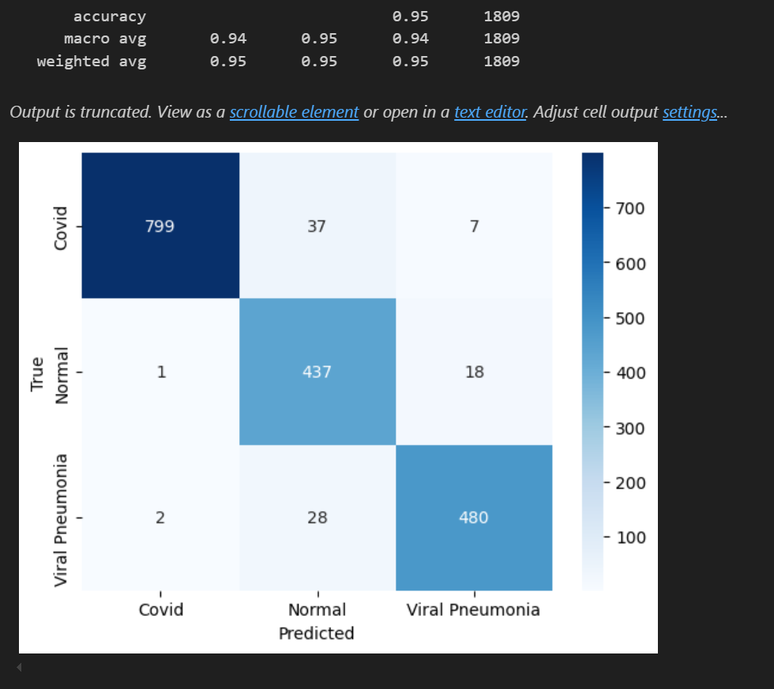

### Training resnet on bilateral dataset

### Training resnet on raw dataset

## Training resnet on canny dataset
e

### Training vgg on bilateral dataset

### Training vgg on raw dataset

### Training vgg on canny dataset

## Justificación de la Elección del Modelo VGG con el Filtro de Canny

En nuestro proyecto, hemos evaluado diferentes modelos de inteligencia artificial para el procesamiento de imágenes, y hemos encontrado que el modelo VGG combinado con el filtro de Canny ha proporcionado los mejores resultados.

### Resultados de Precisión
El modelo VGG con Canny ha alcanzado una precisión impresionante del 95% en un conjunto de datos de 1809 imágenes. A continuación, se detallan las métricas obtenidas:

- Precisión (accuracy): 0.95
- Promedio macro (macro avg): 0.94 (precisión), 0.95 (recall), 0.94 (f1-score)
- Promedio ponderado (weighted avg): 0.95 (precisión), 0.95 (recall), 0.95 (f1-score)

### Análisis de Resultados
Estos resultados indican que el modelo no solo es altamente preciso, sino que también mantiene un equilibrio adecuado entre precisión y recall, lo que es crucial para aplicaciones prácticas. El uso del filtro de Canny ha mejorado significativamente la capacidad del modelo para detectar bordes y características importantes en las imágenes, lo que ha contribuido a su alta precision.

## TL;TR
En resumen, la combinación del modelo VGG con el filtro de Canny ha demostrado ser una elección excelente para nuestro proyecto, proporcionando resultados consistentes y de alta calidad. Esto nos da confianza en la robustez y fiabilidad del modelo para tareas de procesamiento de imágenes en el futuro.
