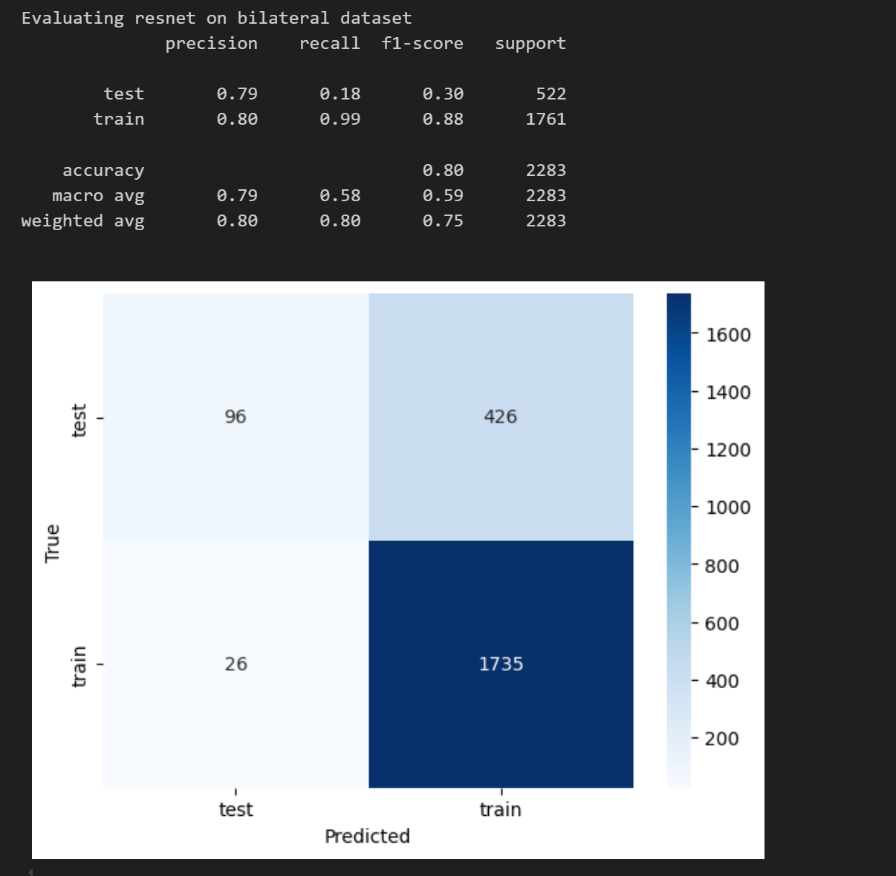
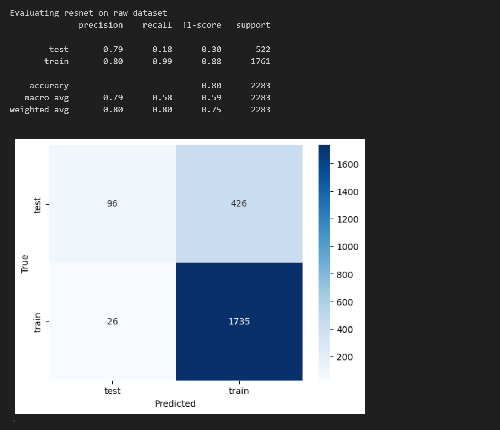
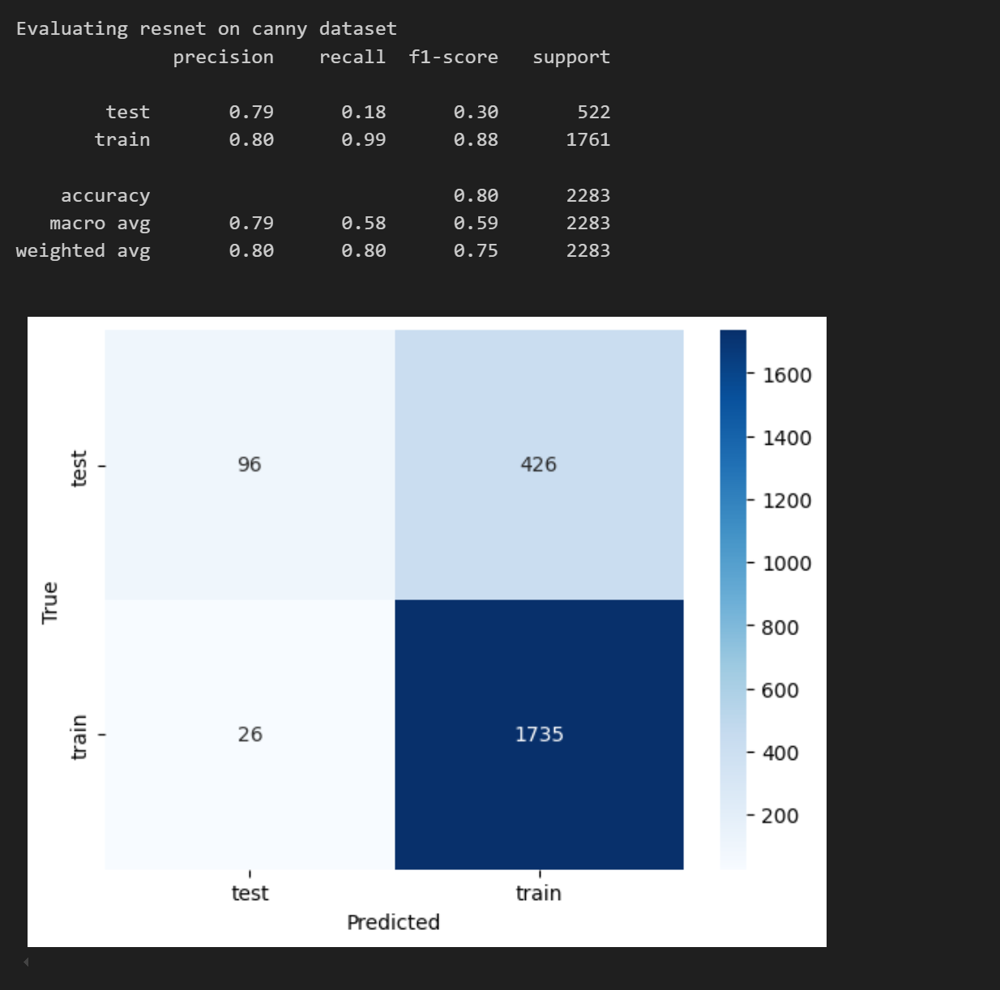
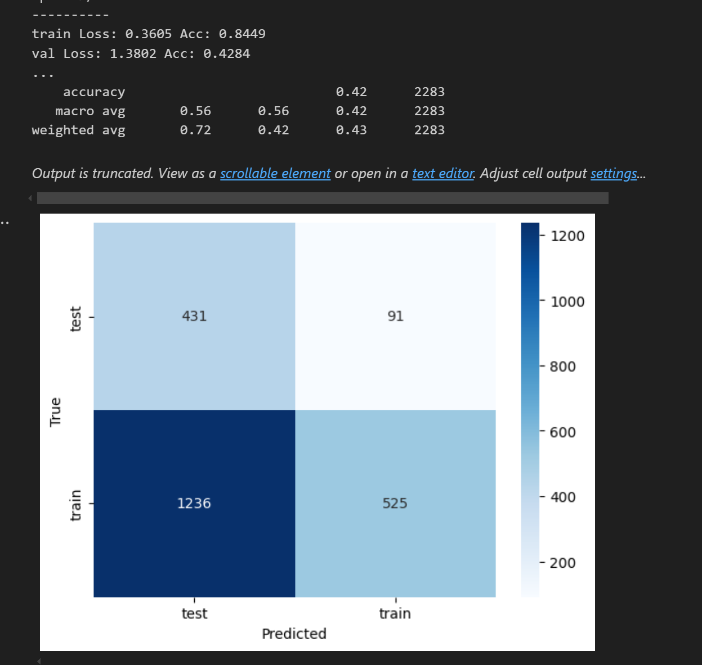
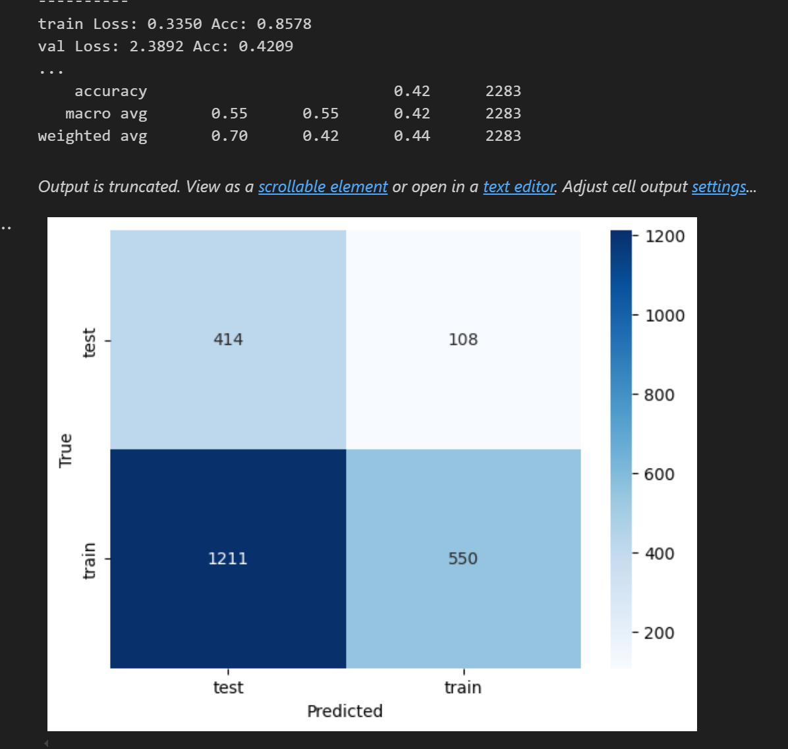
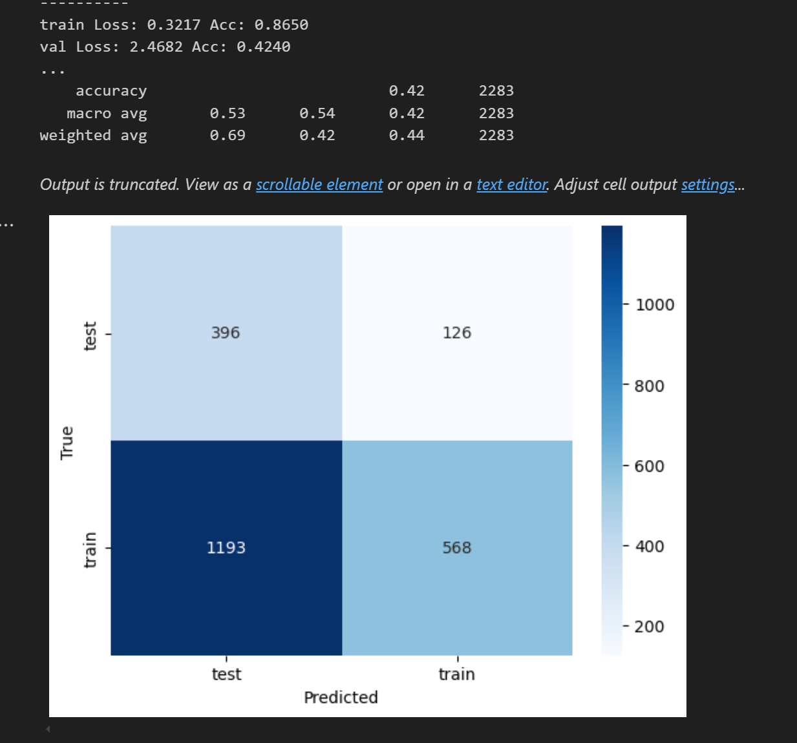
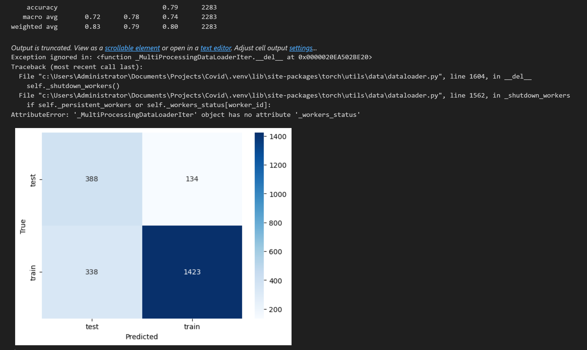
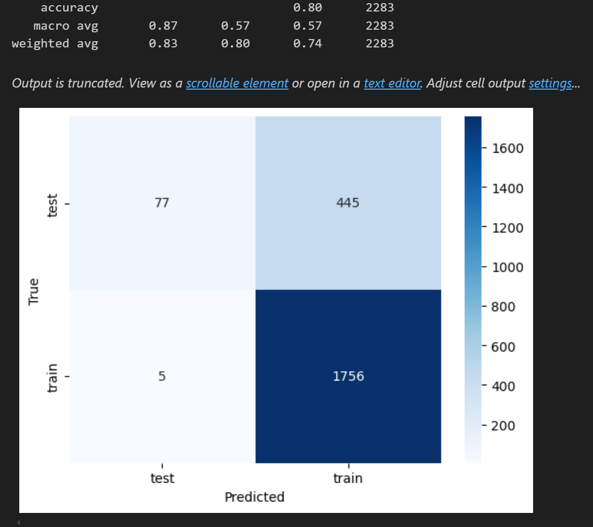
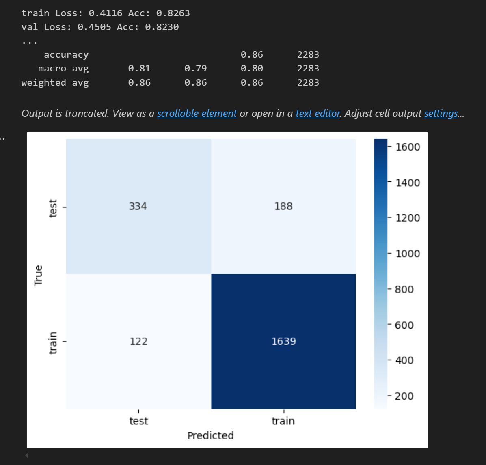

## Antes del Ajuste

## Despues del Ajuste

### Training resnet on bilateral dataset

### Training resnet on raw dataset

## Training resnet on canny dataset

### Training vgg on bilateral dataset

### Training vgg on raw dataset

### Training vgg on canny dataset

